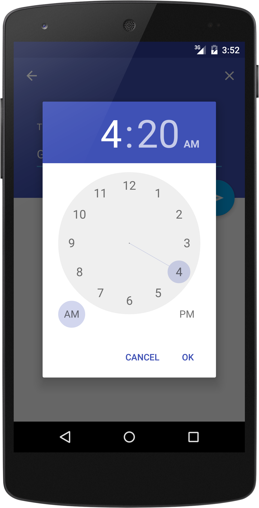

# Thoughts

This is an interpretation of the Clean Architecture pattern, using a decorator pattern.
The decorator is boiler plate code generated by a library (executor decorator)

There are multiple advantages for using this method :
- The complexity of going on the background thread is delegated to Dagger => All the classes stay clean & easy
- All the background thread is tested completely outside of the Android environment => Easy to run on a CI
- When the UI calls calls the background (UI -> controller -> interactor -> repository -> interactor -> presenter -> UI) to execute a complex operation, all the work is done in synchrone mode, and doesn't block the UI

The responsibilities are separated, this project doesn't really show it, because of the simplicity of the actions required.
- Right now, the controller is not really used. In a complex activity, we could show a form, and manage the user interactions through the controller by setting up the views in it, and managing which info would be sent to the interactor.
- The interactor implements the business rules, it calls the repository, then can sort, filter the data, store it in multiple repository implementations (Database, Api, mocks...)
- The repository just calls the Api, selects which data to keep, and builds entities
- The presenter gets raw data from the interactor and... presents it, by transforming an amount in readable text ready to be displayed by the UI

__This is basically a schema of the architecture used in this project:__

</>

# Minimal

A fully Material ToDo app with minimal features, just enough to be useful.

# Screenshots:
 

